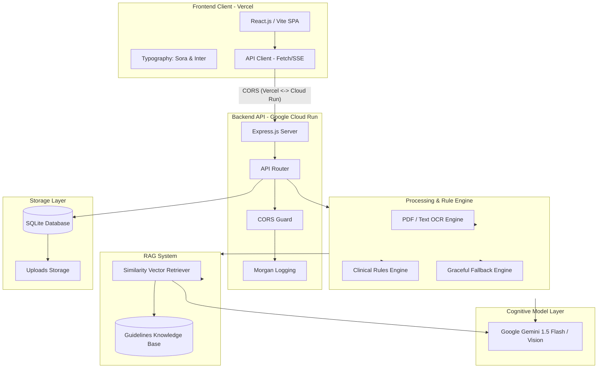
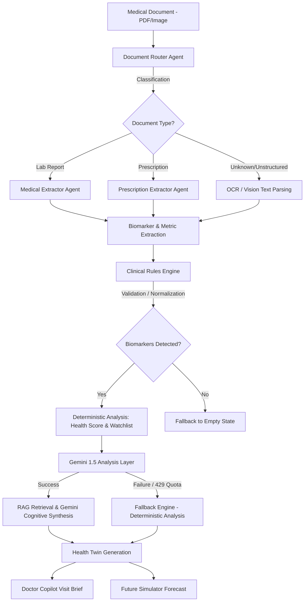
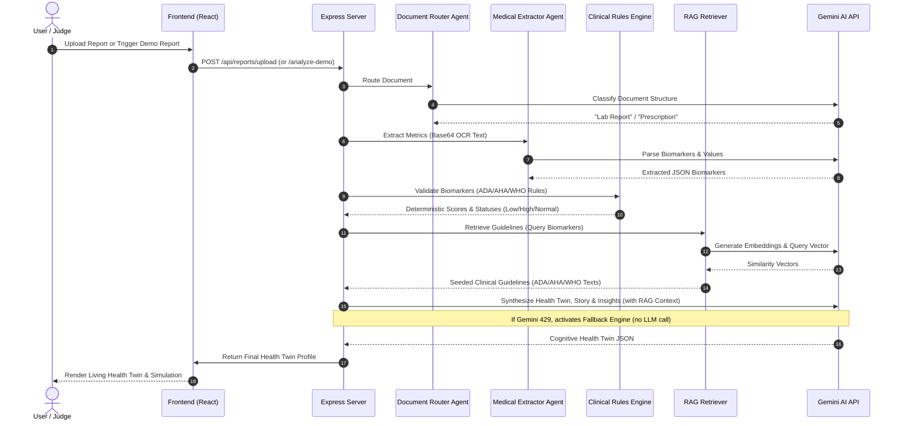
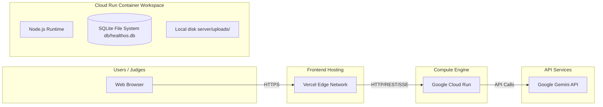

# HealthOS

### AI-Powered Digital Health Twin Platform

---

## Overview

HealthOS transforms unstructured medical reports, hand-written prescriptions, radiological scans, and longitudinal health records into a structured, living **Digital Health Twin**. By coupling robust optical character recognition (OCR) and computer vision with deterministic clinical rule validation and advanced LLM reasoning, HealthOS translates complex clinical biomarkers into actionable, personalized patient stories, a simulation environment for forecasting future health trajectories, and a co-pilot tool optimized for clinical consultation.

```
       Medical Document
               ↓
    Document Classification
               ↓
          OCR / Vision
               ↓
      Biomarker Extraction
               ↓
     Clinical Rules Engine
               ↓
         RAG Retrieval
               ↓
    Health Twin Generation
               ↓
        Doctor Copilot
               ↓
       Future Simulator
```

---

## Core Features

*   **Digital Health Twin**: A multi-dimensional biological simulation that scores metabolic, cardiovascular, nutritional, and immune indicators using personal biomarkers to construct a living health index.
*   **Doctor Copilot**: An interactive consultation assistant that formats biomarkers into an optimized clinical brief, constructs structured discussions, suggests follow-up diagnostic tests, and flags critical red-letter lab entries.
*   **Future Simulator**: A deterministic forecasting dashboard that projects biological age adjustments and biomarker trajectories based on specific daily adjustments (e.g., nutrition, training, sleep, supplementation).
*   **Document Intelligence**: Multi-tiered document classifiers that route laboratory reports or prescriptions to target extraction pipelines.
*   **Clinical Rules Engine**: A deterministic validation boundary built on ADA, AHA, WHO, and Endocrine Society reference guidelines that intercepts metric ranges before model ingestion to prevent AI hallucination.
*   **RAG-Powered Medical Insights**: A vector-retrieval system utilizing Gemini embeddings and cosine-similarity searches to reference established medical guidelines and append clinical citations to every AI recommendation.
*   **Health Timeline**: An interactive chronological log tracking biomarker progression, physical exams, and health milestones.
*   **Health Chat**: An end-to-end SSE-streaming chat interface designed for conversational health questions backed by retrieved context and clinical safety guidelines.
*   **Demo Reports**: A frictionless demo environment with three pre-seeded scenarios (Healthy Adult, Vitamin D Deficiency, Metabolic Risk) allowing instant platform testing without uploading personal files.

---

## Architecture Overview

HealthOS uses a decoupled Client-Server architecture designed for rapid scaling, minimal latency, and robust offline fallback capabilities.

### System Architecture



### Upload Processing Pipeline



### Agent Workflow



### Deployment Architecture



---

## Gemini Integration

HealthOS is powered natively by Google's Gemini API ecosystem. We utilize models to execute complex visual extraction, structured entity parsing, routing, and cognitive synthesis.

### Model Choices & Rationale
*   **Gemini 1.5 Flash**: Chosen for core text processing, document routing, structured biomarker extraction, and streaming chat generation. Flash provides sub-second execution speeds, structured JSON schemas, and highly competitive pricing models, which minimizes latency.
*   **Gemini 1.5 Pro**: Reserved for deep multi-document trend intelligence and predictive simulations where complex reasoning across longitudinal history is required.

### Key Integration Points

1.  **Document Routing**: Upon upload, a structured prompt evaluates the metadata and initial lines of extracted text to determine if the document is a blood laboratory report, an apothecary prescription, or a patient intake form, routing it to the appropriate extractor.
2.  **Report Extraction**: The `medicalExtractor` agent converts unstructured OCR content into raw JSON matching strict validation schemas, preventing the LLM from outputting unstructured sentences.
3.  **Doctor Copilot Briefing**: Using the extracted biomarkers, Gemini builds clinical consultation scripts. It synthesizes discussion topics, prioritizing them by severity (e.g., classifying a critical low in Hemoglobin over a borderline high in Triglycerides).
4.  **Future Simulator Forecast**: Gemini correlates input parameters (e.g., "+30 mins cardio daily") with physiological effects to construct a progressive 90-day chart showing estimated trajectory gains.
5.  **RAG Guidance Matching**: Prompt payloads are dynamically injected with matching guidelines retrieved from our database. Gemini uses these clinical citations to ground its recommendations.

### Graceful Degradation & Quota Fallbacks

> [!IMPORTANT]
> To prevent application crashes during 429 Quota Exceeded rates or network timeouts, HealthOS implements a dual-mode fallback architecture.

If the Gemini API returns an error or quota limit:
1.  The platform intercepts the exception at the routing wrapper level.
2.  **No error message is exposed to the user.**
3.  The request is immediately redirected to the **Deterministic Fallback Engine** (`server/pipeline/fallbackEngine.js`).
4.  This engine uses the local `clinicalRules.js` parser to grade the blood values, compute the category scores, compile warning lists, and select pre-written clinical recommendations.
5.  The frontend displays the generated Health Twin with a clear indicator tag: *"AI-powered insights are temporarily offline. Your Health Twin was successfully compiled using validated clinical reference guidelines."*

---

## RAG Architecture

The Retrieval-Augmented Generation (RAG) system forms the "Trust Layer" of HealthOS.

```
       User Query / Biomarker Risk
                   ↓
      [gemini-embedding-004] (Vector)
                   ↓
        Cosine Similarity Check
                   ↓
     Seeded Clinical Guidelines Database
                   ↓
      Grounding Context + Citations
                   ↓
          Gemini Synthesis
```

*   **Knowledge Base**: A curated, localized database (`server/rag/knowledgeBase.js`) seeded with clinical definitions from the ADA, AHA, WHO, NIH, and American Thyroid Association (ATA).
*   **Retrieval Process**: When a user asks a question or has abnormal biomarkers, the retriever converts the query into a multi-dimensional vector using Gemini embeddings.
*   **Similarity Matching**: Cosine similarity calculations match the query vector against our pre-computed guidelines database, extracting the top 2 matching guidelines. If Gemini's embedding API is offline, the system automatically falls back to a term-frequency keyword search.
*   **Evidence and Citations**: Every RAG-retrieved document is appended to the synthetic context. The final response renders these guidelines in a dedicated "Citations & Sources" panel on the frontend, establishing clinical accountability.

---

## Clinical Rules Engine

Medical platforms cannot rely solely on the statistical probability of large language models for diagnosing biomarkers. HealthOS solves this by running a **Clinical Rules Engine** (`server/pipeline/clinicalRules.js`) before LLM reasoning.

*   **Deterministic Evaluation**: The engine uses hard-coded logic mapping to official clinical targets (e.g., Fasting Glucose >= 126 mg/dL always maps to "Diabetes Range", HbA1c < 5.7% is "Normal").
*   **Zero Hallucination Zone**: All boundary assessments, low/high flags, and healthy indicators are evaluated deterministically.
*   **Biomarker Normalization**: The engine acts as a data normalizer, correcting varied spelling formats (e.g., matching "Hgb", "Hemoglobin", and "Haemoglobin" to the same rule) and converting units to standard references.

---

## Technology Stack

*   **Frontend**: React (Vite), Tailwind CSS-inspired premium Vanilla CSS, custom HSL color palettes, custom SVG indicators.
*   **Typography**: Sora (Headings), Inter / Manrope (Body body, fallback).
*   **Backend**: Node.js, Express.js.
*   **Database**: SQLite (initialized via `better-sqlite3` for light, low-latency relational data storage).
*   **AI/LLM**: Google Gemini SDK (Gemini 1.5 Flash, Gemini 1.5 Pro, Text-Embedding-004).
*   **OCR**: Tesseract.js (local OCR processing for document parsing).
*   **Deployment**: Vercel (Frontend), Google Cloud Run (Containerized Backend).

---

## Project Structure

```
HealthOS-MLH/
├── assets/                    # Static asset files
│   └── demo-documents/        # Seed PDF files for frictionless judge testing
├── db/                        # SQLite Local Database files (gitignored in production)
├── public/                    # Public static files
│   └── assets/                # Demo PDFs mirrored for public client downloads
├── server/                    # Express.js Backend Application
│   ├── agents/                # Cognitive Agents (geminiClient, routers, extractors)
│   ├── db/                    # DB connections, SQLite schema, migration scripts
│   ├── pipeline/              # Rules Engine, Fallback Processor, PDF OCR Extractor
│   ├── prompts/               # Structured prompt files (.txt) fed to Gemini
│   ├── rag/                   # RAG retriever and guidelines database
│   ├── routes/                # API Endpoints (Chat, Insights, Reports, Simulator)
│   ├── scripts/               # Helper utilities (demo-report PDF generators)
│   ├── uploads/               # Temporary uploaded files (gitignored)
│   ├── index.js               # Application Entry Point
│   └── .env.example           # Server Environment Variables template
├── src/                       # React Frontend Application
│   ├── api/                   # Fetch API Client and SSE streaming handlers
│   ├── assets/                # Local UI asset images
│   ├── components/            # Reusable UI elements (Navigation, Cards)
│   ├── data/                  # Local mock fallback datasets
│   ├── pages/                 # Layout components (Landing, Twin Reveal, Copilot)
│   ├── App.jsx                # Main Frontend Router and State Manager
│   └── index.css              # Base styling guidelines and custom HSL variables
├── vercel.json                # Vercel SPA Routing Configuration
└── vite.config.js             # Vite Build Tool Settings
```

---

## Local Development

### Prerequisites
*   Node.js (v18 or higher)
*   npm

### Installation

1.  Clone the repository:
    ```bash
    git clone https://github.com/your-username/HealthOS.git
    cd HealthOS
    ```

2.  Install backend dependencies:
    ```bash
    cd server
    npm install
    ```

3.  Configure backend environment:
    ```bash
    cp .env.example .env
    # Open server/.env and add your GEMINI_API_KEY
    ```

4.  Install frontend dependencies:
    ```bash
    cd ..
    npm install
    ```

### Running Locally

To run the application in development mode:

1.  Start the backend server (from the root or server directory):
    ```bash
    cd server
    node index.js
    ```
    *The server will run on `http://localhost:3001`.*

2.  Start the frontend development server:
    ```bash
    cd ..
    npm run dev
    ```
    *The frontend will open on `http://localhost:5173`.*

---

## Deployment

### Backend (Google Cloud Run)

To deploy the Express server container:
1.  Ensure you have the Google Cloud SDK configured.
2.  Build the Docker container and push to Artifact Registry:
    ```bash
    gcloud builds submit --tag gcr.io/your-project/healthos-backend
    ```
3.  Deploy to Cloud Run:
    ```bash
    gcloud run deploy healthos-backend \
      --image gcr.io/your-project/healthos-backend \
      --platform managed \
      --set-env-vars GEMINI_API_KEY="your-prod-key",NODE_ENV="production" \
      --allow-unauthenticated
    ```

### Frontend (Vercel)

To deploy the React application:
1.  Link your project to Vercel:
    ```bash
    vercel
    ```
2.  Set the Production Environment Variable:
    *   `VITE_API_URL` = `https://your-cloud-run-url.run.app/api`
3.  Deploy to Production:
    ```bash
    vercel --prod
    ```

---

## Security

1.  **Secret Management**: Active credentials (like `GEMINI_API_KEY`) are dynamically loaded via environment variables and are excluded from all compiled Git files.
2.  **Upload Validation**: Files uploaded are restricted to `application/pdf` and image types under 20MB.
3.  **Data Isolation**: Data uploaded during diagnostic checks is stored locally in ephemeral folders (`server/uploads/`) and cleared periodically.
4.  **Hallucination Prevention**: Output limits are enforced via deterministic thresholds before Gemini receives the extraction data, verifying that values do not exceed physiological limits.
5.  **Rate/Quota Management**: Built-in 429 exception handlers immediately route requests to offline rules-based scoring engines without displaying system crashes or logs to the user.

---

## Future Roadmap

*   **Wearable Sync (HealthKit / Fitbit)**: Automatically pull sleep data, heart rate variability, and step tracking to overlay physical logs with blood biomarkers.
*   **Dynamic Health APIs**: Integration of clinical exchange platforms (HL7 FHIR standard) to allow users to directly request medical lab history.
*   **Multi-Twin Modeling**: Simulate chronic disease progressions over 5, 10, or 20-year intervals with interactive toggle levers.
*   **Mobile Companion**: React Native mobile app utilizing local hardware security enclaves to encrypt diagnostic documents.

---

## Screenshots

*Screenshots representing the HealthOS production experience.*

### Processing Pipeline
*A sleek, glassmorphic upload interface showing document classification, OCR parsing progress, and validation.*

### Living Health Twin
*Apple-health styled scoring wheels representing Cardiovascular, Metabolic, Nutritional, and Immune pillars, backed by a comprehensive biomarker watchlist.*

### Doctor Copilot
*An optimized clinical brief with critical checklists, suggested patient discussion topics, and official guideline sources.*

### Future Simulator
*Interactive levers for Sleep, Exercise, and Diet displaying biological age improvements and trajectory estimates.*

---

## License

This project is licensed under the MIT License - see the LICENSE file for details.
